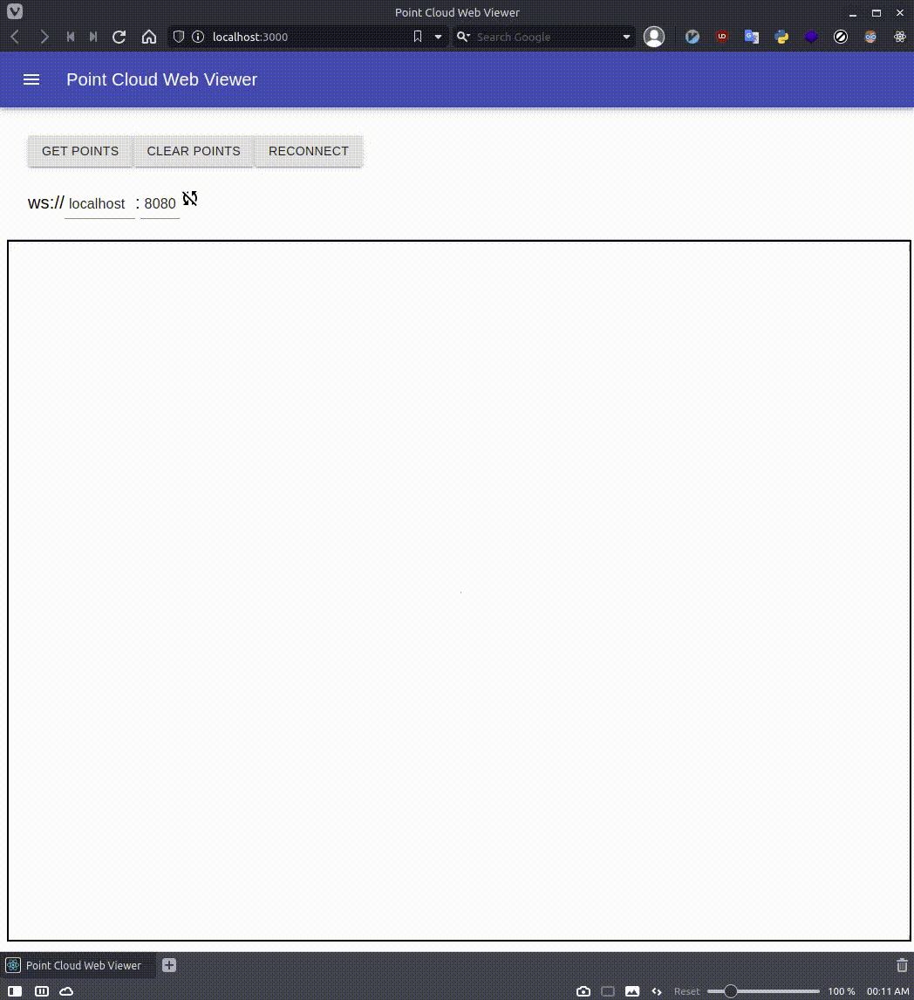

# pointcloud-web-viewer

pointcloud viewer on browser via websocket.

# RUN SERVER

Prepare a PCD file for anything,
Put `server/echo/data.pcd`.

```bash
$ cd server/echo
$ mkdir build
$ cd build
$ cmake ..
$ make
$ ./server 0.0.0.0 8080
```

# RUN CLIENT

Before run client, please run server.

```bash
$ cd client
$ npm install
$ npm start
```

# DEMO VIDEO

## Echo


## Stream



# RUN STREAM SERVER

Prepare PCD files and put `server/streamer/pcds/<filenam>.pcd`.

```bash
$ cd server/streamer
$ mkdir build
$ cd build
$ cmake ..
$ make
$ ./server 0.0.0.0 8080
```
