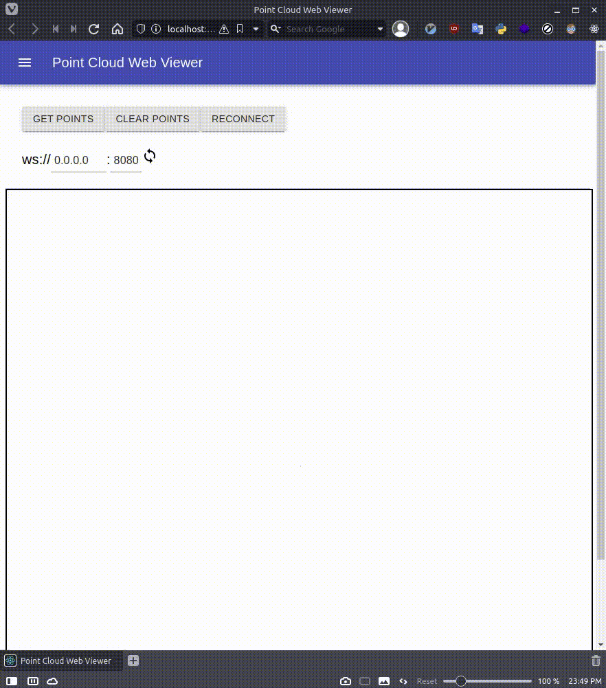

# pointcloud-web-viewer

pointcloud viewer on browser via websocket.

# RUN SERVER

Prepare a PCD file for anything,
Put `server/data.pcd`.

```bash
$ cd server
$ mkdir build
$ cd build
$ cmake ..
$ make
$ ./server 0.0.0.0 8080
```

# RUN CLIENT

Before run client, please run server.

```bash
$ cd client
$ npm install
$ npm start
```

# DEMO VIDEO


